# CA4: Part1 README


The Readme is structured in 1 section:

- **Docker Steps** This part of CA4 focuses on using Docker to run the CA3/Part2 project;

## CA4: Docker Steps

### 0. What is Docker?

**Docker** is, essentially, software that uses virtualization to deliver software packages in the form of containers.

**Containers** are lightweight, isolated environments that share a single operating system and bundle their own software, libraries and configuration files. 
>Containers isolate the applications from their environments, solving the "it works on my machine" headache. 

**Images** are container templates that can easily store and ship applications.

After installing docker we can use the **docker** base command for the Docker Command-Line Interface

### 1. Clone Docker Example

#### 1.1. Clone the project supplied in class:
```
git clone https://manel_rga@bitbucket.org/atb/docker-compose-spring-tut-demo.git
```
___
#### 1.2. Check if the project is working as intended:

In the project root directory:
```
docker-compose up
```
Everything seems to be on the up and up:

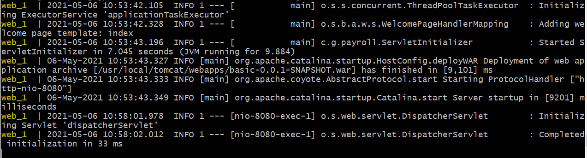
___
#### 1.3. Check if application is running:
```
http://localhost:8080/basic-0.0.1-SNAPSHOT/
```
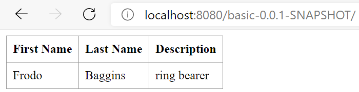

and:
```
http://localhost:8080/basic-0.0.1-SNAPSHOT/h2-console
```
Changing the ```JDBC URL``` to:
```
jdbc:h2:tcp://192.168.33.11:9092/./jpadb
```

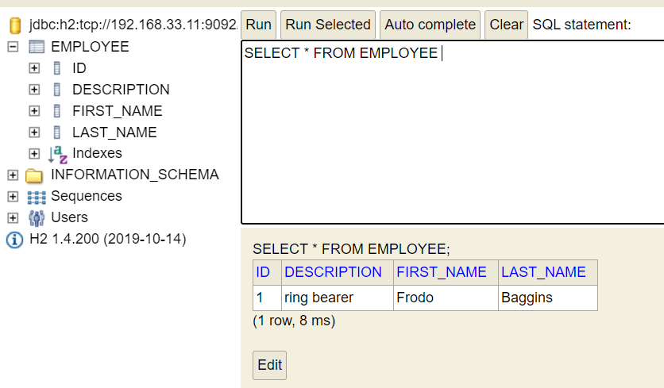

#### 1.4. It's alive!

### 2. Get your CA2/Part2 gradle project working!

We decided to take the more streamlined, but arguably lazy, route of using the provided example as a basis for our gradle application.

#### 2.1. Check the Dockerfiles
Going through **db\Dockerfile** shows that it requires no changes, as our project's DB will be using the same settings as the example's.

**web\Dockerfile** requires some changes, though:

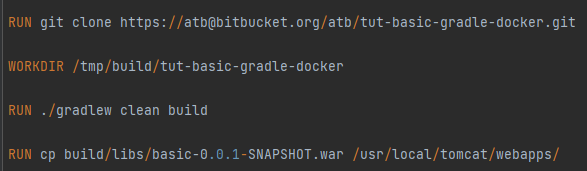

As you can see, it clones a repository, moves to a directory in that repository and copies a file.

#### 2.2. Change web\Dockerfile

Since we'll be using our own repository instead of the example provided in the class we need to change these fields to match our own repository and files:

```
RUN git clone https://manel_rga@bitbucket.org/manel_rga/devops-20-21-1201770.git

WORKDIR devops-20-21-1201770/CA3/Part2

RUN ./gradlew clean build

RUN cp build/libs/demo-0.0.1-SNAPSHOT.war /usr/local/tomcat/webapps/
```

#### 2.3. Remove the previously created Containers
In the root folder, remove the containers after stopping the process. We can see the containers' names when they are stopped:

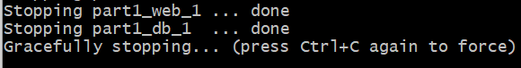
```
docker rm part1_web_1
docker rm part1_db_1
```

#### 2.4. Run the build command again:

We need to update the settings used to create the containers, so run the following command:

```
docker-compose build
```
#### 2.5. Build fails because ./gradlew clean build fails
Having this issue 2 or 3 times in the previous assignements is apparently not enough to learn this. Give the proper authorizations to gradlew file!
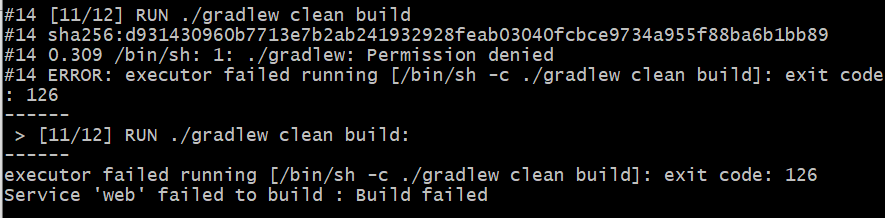

In the web\Dockerfile include the command to give the execute authorization to gradlew.

```
RUN chmod u+x gradlew
```
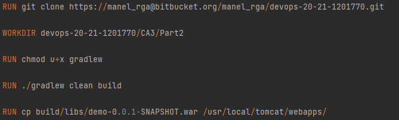

#### 2.6. Run the build command again 2: Electric Boogaloo:
```
docker-compose build
```
#### 2.7. Start the Containers
```
docker-compose up
```
#### 2.8. Access the localhost to check on the DB tables:

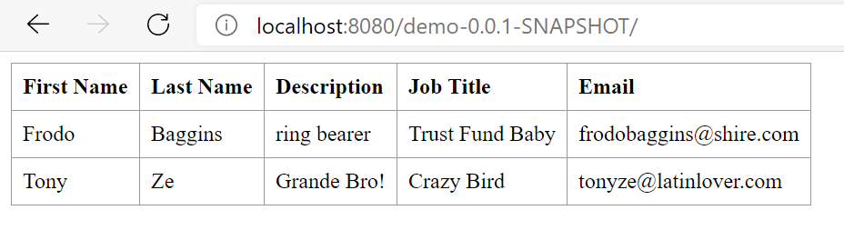

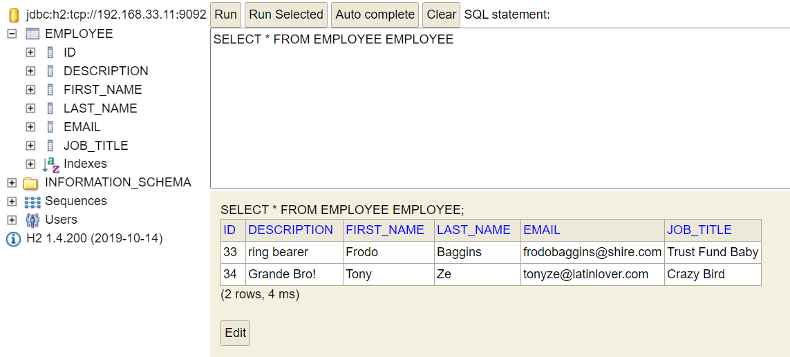

### 3. Push the images to Docker Hub

#### 3.1. In the project root folder open the terminal and push the images using the ```docker push``` command:

```
docker push part1_web
```
Unfortunatelly, this leads only to bitter disappointment:


#### 3.2. Tag your image, so it includes your Docker username after you create a Docker account!
```
docker tag part1_web 1201770/part1_web
```
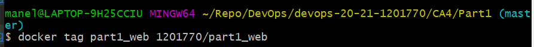

#### 3.3. Push again, this time with feeling:

```
docker push 1201770/part1_web
```

This will take a while, so grab a coffee or something.

Repeat the process for the database.

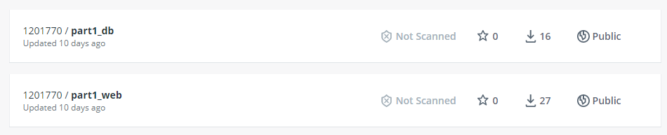


### 4. Copy the database file to the folder created for that purpose

#### 4.1. Access the Docker container:

```
docker exec -it part1_db_1 bash
```
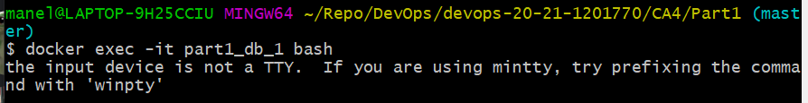

Apparently this doesn't work. There are some issues between windows and unix console API's so we can use winpty before the command to run it.

What is winpty, I hear you ask? :

>winpty is A Windows software package providing an interface similar to a Unix pty-master for communicating with Windows console programs.

>The software works by starting the winpty-agent.exe process with a new, hidden console window, which bridges between the console API and terminal input/output escape codes. It polls the hidden console's screen buffer for changes and generates a corresponding stream of output.

Thank you, *VonC* in [stackoverflow.com](https://stackoverflow.com/questions/48199794/winpty-and-git-bash).
I've learnt something, although what is still to be determined.

#### 4.2. Re-run the command with winpty:
```
winpty docker exec -it part1_db_1 bash
```

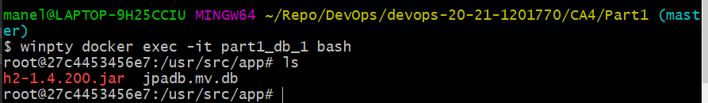

There's the database file! 

#### 4.3. Copy database file:
```
winpty docker exec -it part1_db_1 cp jpadb.mv.db /usr/src/data
```
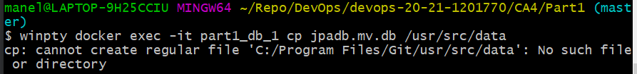

Apparently this doesn't work. There are some issues between windows and unix console API's...
(*deja vu*)

Our dear friend, DevWL, in [stackoverflow](https://stackoverflow.com/questions/65656378/docker-using-gitbash-cmder-path-issue), explains that:
> (...) running ```MSYS_NO_PATHCONV=1``` Before the actual command (...) will disable the path translation for that command.

Might as well try it.

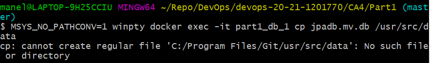

Well, DevWL, it seems your solutions isn't exactly what I need.

On further investigation it becomes clear that the issue is that Linux and Windows paths are declared differently. So docker and windows weren't meant to work together and we should all feel ashamed about doing it... Or should we? 

#### 4.4. Ditch Git Bash, we're going full Microsoft now, kid:

Open Powershell in the project root directory and input the previous command without any of the bells and whistles:

```
docker exec -it part1_db_1 cp jpadb.mv.db /usr/src/data
```
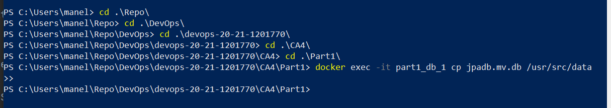
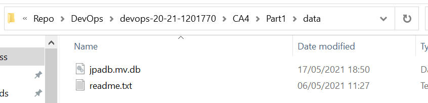

So, Microsoft in all its wisdom includes a path translator in Powershell, which begs the question, why are we using Git Bash?

Well, a black background and fluorescent colours go a long way into making you feel 100% more of a dev, so we endure.

### 5. We're done with the Part1 of CA4!
