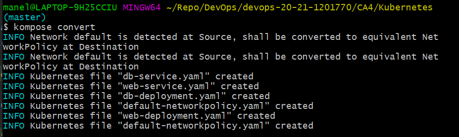

# CA4: Part2 README

The Readme is structured in 1 section:

- **Kubernetes Steps** This part of CA4 focuses on using Kubernetes to run the CA3/Part2 project;

## CA4: Kubernetes Steps

### 0. What is Kubernetes

**Kubernetes** is an open-source container orchestration platform, which purpose is to automate and manage containerized applications, as well as their deployment and scaling.

**Clusters**, as the name suggests, are clusters of computers that are connected to work as a single unit. They are composed by the **Control Plane**, which manages the cluster, and **Nodes**, which are VMs or physical computers serving as worker machines.

**Objects** are persistent entities in the Kubernetes system. They represent the state of the cluster and describe what applications are running, the resources available to the applications and how those applications should behave, such as update and upgrade policies.

We will be using 2 types of these objects to get the application running.

### 1. Install Kubernetes

There are a number of options of software to use kubernets, we chose minikube. It is one of the recommended tools in kubernetes documentation and it automatically creates a single-node cluster locally:


#### 1.1. Install minikube
There are multiple ways to install minikube, we chose the easiest and the funnest, using chocolatey (chocolatey is a package manager)
```
choco install minikube
```

#### 1.2. Start minikube
```
minikube start
```


#### 1.3. Check nodes
You can now run a command to check if a node has been created, as advertised.

Use ```kubectl``` to run commands related to kubernetes:
```
kubectl get nodes
```


You can see the node that has been created automatically by minikube.

### 2. Create objects:

Again, we choose the more streamlined, but still arguably lazy path. In this case we also have limited knowledge on kubernetes settings files, so we will be using a tool to translate dockerfiles to kubernetes files, *kompose*.

#### 2.1. Install kompose:
We will make use of the tools we have, the tools we love.

```
choco install kubernetes-kompose
```

#### 2.2. Run kompose
In the project source directory, which we copied from CA4/Part1:

# STOP!

At this point there is a sort of crosswords where our story diverges into two different paths, one leads to success and one leads to bitter failure. We obviously followed the path of bitter failure first, because we didn't know any better.

```
kompose convert
```



Notice that it creates 5 files? Kubernetes has different kinds of objects, in our case we will be using Service objects and Deployment objects.

- Service objects are an abstract way to expose an application as a network service.
- Deployment objects typically describes the application's lifecycle, such as the images to use, number of replicas and how to update it.

Inspecting the files that were created we can notice that while all the ports have been included in the settings, the IP addresses are suspiciously missing.

We also notice that the *image* section in the deployment files has a default value corresponding to the name of the object being created.

#### 2.3. Update the Image section:

Since we so conveniently pushed our images to docker in the previous part of the assignment, we can now use those here:


Okay, we should be ready to get the ball rolling.

Since we are completely in control of our environment, we remember that there are some changes we need to make in the dockerfiles before we convert them.

### 3. Create the objects

#### 3.1. Run the settings files:
```
kubectl apply -f db-deployment.yaml -f db-service.yaml -f web-deployment.yaml -f web-service.yaml
```


#### 3.2. Check the objects:
```
kubectl get pods
```


### 4. Access the application

There are multiple ways we can use to access the application, as per the documentation, we will try port-forwarding.

#### 4.1. Open the flood gates:
Use the port-forwarding command to  access the web object. Notice that we are using the name of the actual object in this command.
```
kubectl port-forward web-68c7ff5958-bcwvr 8080:8080
```


#### 4.2. Try it on for size:
Access localhost:8080 so we can see if we are devs or bricklayers:


So, good news and bad news. We are accessing the object running the application, as shown by the 404 Status and Apache Tomcat messages, but the application isn't actually loading the database. It stands to reason that we are somewhere between devs and bricklayers, masons maybe.

### 5. The Fellowship of the Kubes

After hitting your head repeatedly against the wall we need to consult our fellow colleagues. I would like to take this moment to thank Filipa Santos from Group 4, Tomas Furtado from Group 2 and, predictably, Bruno from Group 3 for their help and patience.

#### 5.1. application.properties
Immediately we are reminded of the issue we had with Hyper-V were we had to change the application.properties of the application to get the web service to access the database.

At this point we were using the actual project from CA3/Part2, so we try to change the application.properties inside the web object.

#### 5.2. Access the web object:
```
kubectl exec --stdin service/web -- bash
```
This command gives you access to the object's insides, it works similarly to a ssh into a VM or container, but the objects have some limitations like, not being able to install nano to change a file:


### 6. The Two Changes

#### 6.1. Find a way to change application.properties:
Okay, so we can't use nano, but a real mason finds a way, so we change the application.properties locally and copy it into the appropriate directory inside the web object.

In application.properties change the datasource url:
```
spring.datasource.url=jdbc:h2:tcp://db:9092/./jpadb;DB_CLOSE_DELAY=-1;DB_CLOSE_ON_EXIT=FALSE
```
Notice that the URL is changed to the service name, ```db```. We can change the url to the actual IP of the DB object, but if for some reason you wanted to raise more db replicas it wouldn't work for those, this way it is more dynamic and, crucially for this purpose, makes us feel just a tiny bit smarter.

Now copy that file into the object: 
```
kubectl cp /tmp/foo <some-namespace>/<some-pod>:/tmp/bar
```
(This isn't represented with an image and the actual command used because I closed the Git Bash window before I could capture the brilliance of this solution and it was eventually discarded)

#### 6.3. Build the project:
Inside the web object run the ```./gradlew build``` command to use the new properties.

#### 6.4. Copy the .war file:

Again, no representation of this step, but it's a fairly straightforward ```cp``` command inside the web object.

Is it working now? Let's find out:


At this point we are pretty sure everything should be working, but for some, still unknown, reason it isn't.

Life is pain.

#### 6.5. Delete everything, create a new folder for your gradle application:

This section is lacking in detail as it was a bit to graphic to demonstrate, but it went something like this:
.


#### 6.6. We can rebuild it. We have the technology!

We created a new directory with a copy of the project, we need to update the dockerfile to include this new information
.


Change the working directory:


#### 6.7. Repeat steps 2.3. to 6.4.


At this point I had lost a day of work to this so I went out for dinner.

### 7. The Return of the Images

After a nice meal and a few drinks inspiration strikes. You, being the observant and attentive colleagues might even have noticed that we seem to have missed a crucial step.

Remember when we did this and felt so smart in explaining we looked into the kubernetes files:


And then we did this:


The sheer smugness of youth...

Notice how the kubernetes files don't include anything about the repository where the application is being loaded from? And how we are using the images we used in CA4/Part1? Which are using another project that doesn't have an updated application.properties?

We are idiots, don't be like us.

#### 7.1. Create a new web docker image
In the assignment directory: 
```
docker compose build
```


We have the new kubernetes_web and kubernetes_db images in there!

#### 7.2. Tag the newly create images:
```
docker tag kubernetes_web 1201770/kubernetes_web

docker tag kubernetes_db 1201770/kubernetes_db
```

#### 7.3. Push the new images:
```
docker push 1201770/kubernetes_web

docker push 1201770/kubernetes_db
```
#### 7.4. Delete, Update and Apply the objects again:
```
kubectl delete -f db-deployment.yaml -f db-service.yaml -f web-deployment.yaml -f web-service.yaml
```

Change the images to the newly created ones in the deployment objects:


```
kubectl apply -f db-deployment.yaml -f db-service.yaml -f web-deployment.yaml -f web-service.yaml
```
As you can see, the application.properties in the web object is already correct.


#### 7.5. Forward ports in new web object:


```
kubectl port-forward web-7b476b98c6-wd9b5 8080:8080
```

#### 7.5. Make like the hobbits and bow to no one:


### 8. We're done with the Alternative assignment of CA4!
